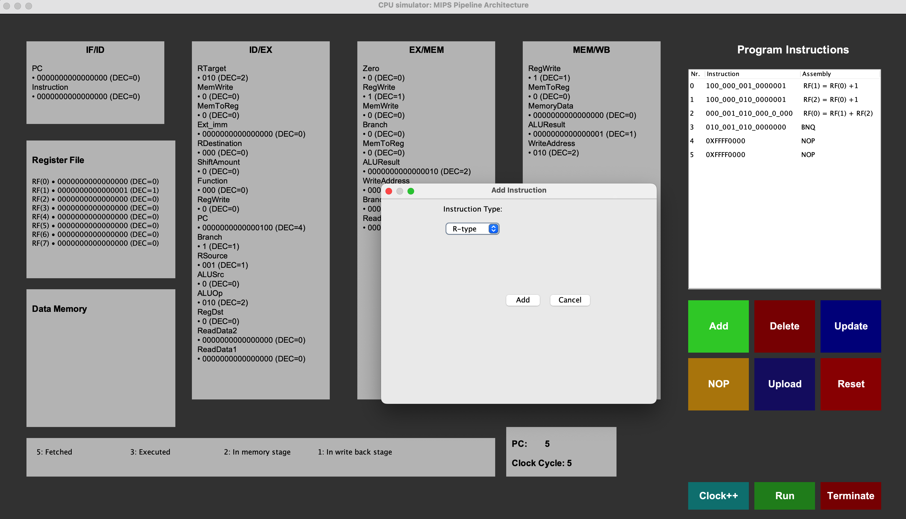

# 🚀 MIPS Pipeline CPU Simulator

## 📖 Introduction

The **MIPS Pipeline CPU Simulator** is a Java-based application that emulates the MIPS pipeline architecture, a widely used RISC (Reduced Instruction Set Computer) design. The simulator is an educational tool designed to:
- 🛠️ Debug and test MIPS code.
- 📋 Visualize pipeline stages and memory states.
- 🚀 Explore optimization techniques like forwarding and branch prediction.

## 👨🏻‍💻 Graphical User Interface 
  

## ✨ Features
- **Pipeline Visualization**:
  - Stages: Fetch, Decode, Execute, Memory, Write Back.
  - Hazard Handling: Data and control hazards with forwarding and branch prediction.
- **User-Friendly GUI**:
  - Dynamic updates of pipeline stages.
  - 🖥️ Real-time display of registers and memory contents.
- **Robust Testing**:
  - JUnit tests for comprehensive verification of functionality.
 
  - ISA:
- **Arithmetic**: `add`, `sub`, `addi`
- **Shifts**: `sll`, `srl`
- **Logic**: `and`, `or`, `xor`
- **Memory**: `lw`, `sw`
- **Control Flow**: `beq`, `bnq`, `jump`
- **Comparison**: `slt`, `slti`

## ⚙️ Project Setup

### Environment
- **Backend**: Java
- **GUI**: Java Swing
- **IDE**: IntelliJ IDEA

### Setup Steps
1. Clone the repository.
2. Open the project in IntelliJ IDEA.
3. Compile and run the application.

## 📚 Pipeline Stages

The MIPS pipeline consists of five stages:
1. **Fetch (IF)**: 🗂️ Retrieves the instruction from memory.
2. **Decode (ID)**: 🧩 Decodes the instruction and prepares operands.
3. **Execute (EX)**: 🔧 Executes arithmetic and logic operations.
4. **Memory (MEM)**: 📦 Accesses memory for read/write operations.
5. **Write Back (WB)**: 💾 Writes results back to registers.

## 🔤 Instruction Set

## 🛠️ Testing and Debugging

- ✅ Comprehensive tests for all instructions, including edge cases.
- 🔍 Data hazard detection verified with forwarding techniques.
- 🧪 JUnit tests for automated validation:
  - **R-Type Instructions**: `add`, `sub`, `and`, `or`, `xor`, `sll`, `srl`, `slt`
  - **I-Type Instructions**: `addi`, `slti`, `lw`, `sw`
  - **Control Flow**: `beq`, `bnq`, `jump`

## 🎨 Graphical User Interface (GUI)

### Features
- **Pipeline Visualization**:
  - Displays the current state of all stages dynamically.
- **Instruction Management**:
  - Add, delete, update, and insert NOP instructions.
- **Real-Time Updates**:
  - Registers and memory contents refresh with every clock cycle.
- **User Controls**:
  - `Clock++`: Advances the simulation by one cycle.
  - `Run`: Starts the simulation.
  - `Terminate`: Stops the simulation and displays the final state.
